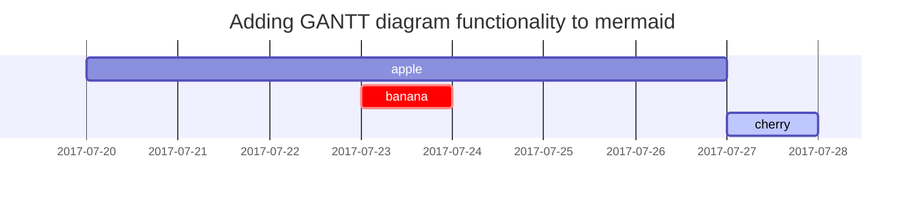

**Учтите, что это полный гайд по прохождению игры на 100%!** Вам нужен этот гайд, если вы хотите пройти *Robotics;Notes ELITE* <ins>**И**</ins> получить все ачивки. Если вы хотите просто пройти игру, ничего не упустив, то вам нужен гайд по рутам, который можно найти [здесь]().

---
# **Предисловие**

*Robotics;Notes ELITE* весьма запутана в плане прохождения и получения всех ачивок – больше других визуальных новелл в серии **Science Adventure.** В игре используется целая комбинация различных триггеров, объединённых в "Триггеры PhoneDroid". Туда входят:

- геотэги в приложении "IRUO."
- схватки в "Kill-Ballad"
- перемещения по карте с помощью "Deluoode Map"
- ответы на твипы через "Twipo"

Некоторые плохие концовки можно получить только через Kill-Ballad, но, в основном, весь выбор рутов и концовок зависит от выборов в Twipo.

В новелле главы называются фазами. Проходить вслепую строго не рекомендуется, поскольку так можно упустить много контента и попасть на фазу 08, миновав фазы 06 и 07. Этот гайд поможет вам пошагово пройти новеллу, ничего не упустив, а также проведёт вас по рутам в правильном порядке прохождения и позволит получить все ачивки в стиме.

**<u>ВАЖНО:</u>** если у вас установлен [патч от Committee of Zero]() (который *крайне* рекомендован к установке, поскольку правит огромное количество ошибок перевода, опечаток, добавляет поддержку мыши и улучшает отображение шрифта), то вам нужен **[этот гайд]()**. Он написан с учётом внесённых правок и соответствует текстам в патче.

**Ну а теперь погнали! Шторм и буря! Взрывная волна! Ганваррель! *JYAKIIIIIN!***

## Условные обозначения

Для удобства, в этом гайде игровые триггеры отмечены разными способами. Например, геотэги будут выглядеть так:

> *GEOTAG № XXX: Steins Gate*

А твипы будут отображаться по-другому:

> **NEIDHARDT: Whose eyes are those eyes?**
>
> Ответ: Those eyes are god's eyes

------


# **ФАЗА 1**

## **6.10.2019 - Понедельник**

Исход первой схватки в **Kill-Ballad** (KB) ни на что не влияет, за исключением реакции главного героя на проигрыш/выигрыш. Иконки в обучающем баннере взяты с версии игры на Playstation, но в ПК-версии в самой Kill-Ballad используются клавиши WASD. Иконки в обучении отобразятся правильно, если вы играете на консоли, либо с геймпадом на ПК.

После окончания схватки, как только игра даст вам доступ к PhoneDroid (на экране будет сцена с Акихо), откройте **IRUO.** на **PokeCom.** Затем найдите следующие **геотэги**:

> - *GEOTAG № 072: Robot Research Club*
> - *GEOTAG № 073: Soccer Club Equipment Storage*
> - *GEOTAG № 074: Volunteer Group*
> - *GEOTAG № 075: Surf Group Equipment Storage*
> - *GEOTAG № 001: Akiho Senomiya*

Затем откройте приложение **Twipo** и ответьте на твипы в следующем порядке:

> **AKIPOPOPOOON: Because he was a spoiled brat**
>
> Ответ: Was that the Red Comet?

> **AKIPOPOPOOON Gonna go to tea time with Yamada from Japanese class**
>
> Ответ: Yamada is a nice guy

> **AKIPOPOPOOON Vice Principal didn’t come. Didn’t see her again…**
>
> Ответ: Maybe send a letter?

> **AKIPOPOPOOON @UMISHO You at the club room?**
>
> Ответ: I am

> **AKIPOPOPOON Gonna go to the club room! Storm and Stress! Energy Explosion!!!**
>
> Ответ: I can see you really screaming

Позже в школе у вас будет схватка с Акихо в **Kill-Ballad**. Её ник в **KB**– **AKI-PO**. После этого, вечером, вам нужно будет ответить на ещё один твип от Акихо:

> **AKIPOPOPOOON Is This Youth?**
>
> Ответ: If it’s KB I can pull an all-nighter

Спустя какое-то время, вы окажетесь на заброшенном аэропорту Танегашимы. Оказавшись в ангаре, откройте **IRUO.** и получите ещё один геотэг:

> *GEOTAG № 052: Gunvarrel Prototype Model-1 Lower Half*

Снаружи ангара можно найти ещё два геотэга, получаемых автоматически в процессе игры:

> *GEOTAG No. 084: Central Tanegashima High Robot Club Hangar*
>
> *GEOTAG No. 085: Central Tanegashima High Robot Club Equipment*
>
> *Automatic Story Geotag: GEOTAG No. 114: Lonsow Minamitane-cho Branch*

Оказавшись у терминала аэропорта, вас будет ждать ещё четыре геотэга:

> *GEOTAG No: 086: Old Tanegashima Airport Terminal*
>
> *GEOTAG No: 087: From Airport Administration Office*
>
> *GEOTAG No. 055: MI361X*
>
> *GEOTAG No. 054: MA808X*

## **6.11.2019 – Вторник**

Вы попадёте в **магазинчик Ирей** (*Irei General Store*), где, находясь снаружи, вам нужно будет открыть ещё два геотэга и ответить на твип:

> *GEOTAG No. 104: Irei General Store*
>
> *GEOTAG No. 105: Beverage Corner*

> **AKIPOPOPOOON Started watching Faibird again and got hooked and watched 10 eps. Look at the time!**
>
> Ответ: I told you not to stay up late. Gotta follow that rule

Внутри магазина будут ещё пять геотэгов:

> *GEOTAG No. 007: HUG HUGR-03 HAYATE*
>
> *GEOTAG No. 109: Brand New! Passion Fruit Bun!*
>
> *GEOTAG No. 108: Benny-chan Card*
>
> *GEOTAG No. 106: Skal White*
>
> *GEOTAG No. 107: Fruit Sour Melon*

Находясь на лужайке у кружка возле школы, ответьте на твип Акихо:

> **AKIPOPOPOOON: OHNOOOOOOOOOOOOOOOOOOOOOOOOOOOOOOOOOOOOOOOOOOOOOOOOOOO**
>
> Ответ: Forget the club room key?

## 6.12.2019 – Среда


Everytime you’re in the classroom, when IRUO. is available, make sure to claim the “Today’s Chore Duty” geotag. This is a recurring geotag. This guide will remind you when they’re available. Inside the classroom, make sure to pick it up, and reply to Aki’s tweeps. One of these won’t show up until later in the scene, as it serves as a tutorial for Twipo.

*GEOTAG No. 020: Today’s Chore Duty*

**AKIPOPOPOOON I want to eat takoyaki**
Reply: Aren’t you supposed to eat those on cold days?

**AKIPOPOPOOON PrinceX is so cute! The design taste is good that even though it’s a giant robot, I think it’s cute. TAYOTA of the world! It would be amazing if we can put this electic engine in GunBuild-1! Maybe I’ll go negotiate next time. Wonder if they’ll let me borrow it for free. I’ll send an email**
Reply: Can’t you just put in an electric car engine to solve the problem?

At the shoe racks at school, wait for Subaru to enter the scene, then open IRUO. to claim two additional geotags.

*GEOTAG No. 083: To All Students*
*GEOTAG No. 005: Subaru Hidaka*

Likewise, once you’re inside the clubroom for the Robot Club, there are a bunch of geotags waiting.

*GEOTAG No. 017: Space Candy*
*GEOTAG No. 018: TanegashiMachine 3*
*GEOTAG No. 076: Gunvarrel BD*
*GEOTAG No. 077: JAXA*
*GEOTAG No. 078: Robot Club Equipment 1*
*GEOTAG No. 079: Robot Club Equipment 2*

## 6.13.2019 Wednesday

Just outside the school grounds, there’ll be a few geotags and tweeps to take care of:

*GEOTAG No. 080: Kagoshima Prefecture Central Tanegashima High School*
*GEOTAG No. 081: First Campus Tour*
*GEOTAG No. 082: Second Campus Tour*

**AKIPOPOPOOON I’m glad I finished hw in time! Thank god we have somewhere to go home to. So glad!**
Reply: A place to go home? What are you talkin about?

A bit later, once Junna shows up, make sure to get her geotag as well:

*GEOTAG No. 003: Junna Daitoku*

Later on, in the classroom, make sure to pick up the usual geotag. There will also be some tweeps for you to reply to. 

*GEOTAG No. 021: Today’s Chore Duty*

**AKIPOPOPOOON: You don’t know… I’ll show you next time**
Reply: Oh I get it. Another parody of a robot anime line. Don’t really know which one, but sounds like one based on your words

**AKIPOPOPOON: Today I gotta go pick up parts from Doc. I have to go on the Thunder Emperor again…**
Reply: You prolly know, but you should take medicine for motion sickness.

In the staff room, you will encounter Vice Principal Kauruko Usui. Make sure to pick up her geotag as well.

*GEOTAG No. 012: Kaoruko Usui*

Back in the classroom, there will be a single extra tweep waiting for you.

**AKIPOPOPOOON: …I’m not gonna lose**
Reply: I can’t fight on an empty stomach

## 6.14.2019 Friday

The only thing to worry about during this day is in the classroom, there’s the usual geotag. Make sure to get it. Akiho will also have a tweep for you.

*GEOTAG No. 022: Today’s Chore Duty*

**AKIPOPOPOOON Watched Gaigaoger this morning!!!**
Reply: Feel better after sleeping?

## 6.15.2019 Saturday

Starting off the day outside Akiho’s house, there’s a single geotag you’ll need to claim:

*GEOTAG No.088: Senomiya*

Once you make it inside her house, there will be a few more geotags and a single tweep to take care of, which takes care of the rest of the day.

*GEOTAG No. 089: Hero of Sunlight Fireburn*
*GEOTAG No. 090: RMS-154 Berzau*
*GEOTAG No. 091: Amazing Invincible Raigin-oh*
*GEOTAG No. 092: Franbear*

**AKIPOPOPOOON @UMISHO Staying up again… BAD!!!**
Reply: Sorry

## 6.16.2019 Sunday

At the parking lot, there will be two additional geotags waiting for you. These will also be recurring every time you visit here, so make sure to get the ones here. Additionally, Akiho has a tweet that you need to reply to.

*GEOTAG No. 031: NSU999X*
*GEOTAG No. 033: MU593X*

**AKIPOPOPOPOOON It’s sunny! Feels GOOD! I wanna go to the beach!**
Reply: Thinkin about it, haven’t gone to the beach in years. Maybe since Misa-ne was still on the island

When you make your way to the Robot Clinc, before you enter, make sure to claim the geotag there and reply to the tweeps.

*GEOTAG No. 111: Robot Clinic*

**AKIPOPOPOPOOON Finger Vulcan!**
Reply: Does the Honorary Prez even have fingers in the first place?

**AKIPOPOPOPOOON @UMISHO That’s not possible. I went once in junior high. Mizuka-ne took me**
Reply: Right. You pulled a muscle in the water and almost drowned. I only kinda remember

Once you make it inside the robot clinic, there will be an additional 2 geotags to claim.

*GEOTAG No. 112: From Robo Doctor*
*GEOTAG No. 010: Tetsuharu Fujita*

Sometime after, you will battle Akiho in Kill-Ballad once again.

## 6.17.2019 Monday

This day only has one tweep to reply to, from Akiho. It’ll be inside the Irei General Store.

**AKIPOPOPOPOOON I wonder if there’s a part time job I can make quick cash…**
Reply: Construction worker

## 6.18.2019 Tuesday

This day only has things going on in the classroom. Make sure to pick up the usual geotag.

*GEOTAG No. 023: Today’s Chore Duty*

**AKIPOPOPOPOOON @UMISHO You ok? Eat something bad?**
Reply: I did… It might be the key to losing weight…

## 6.19.2019 Wednesday

Make sure to reply to these tweeps from Akiho. These are the only things to keep track of on this day.

**AKIPOPOPOPOOON YASSS! Successfully got new years + allowance early! We are gonna win ROBO-ONE!**
Reply: Oh, congratz

**AKIPOPOPOPOOON Mom got mad at me…**
Reply: calm down. Lol

## 6.20.2019 Thursday

On this day, you won’t have to reply to any tweeps. Make sure to get Mitchi’s geotag, though.

*GEOTAG No. 009: Mitsuhiko Nagafukada*

## 6.23.2019 Sunday

There’s only a single tweep to reply to this day. Be sure to reply to it.

**AKIPOPOPOPOOON Im bored. Imma dream about this school transforming into a robot**
Reply: That’s sounds like something a guy would imagine.Or a kid.The clock turns into a face right?

## 6.26.2019 Wednesday

Starting off the day, make sure to reply to this tweep by Akiho.

**AKIPOPOPOPOOON @UMISHO me too!**
Reply: I guess we’ll both retake the test in the summer vacation

After that, when you make it to the Parking Lot, make sure to grab the geotags there.

*GEOTAG No. 036: NE738X*
*GEOTAG No. 037: ME672X*

When you get to Uchugaoka Park, make sure to claim the geotags there as well.

*GEOTAG No. 096: Uchugaoka Park*
*GEOTAG No. 097: Minamitane-cho Local District Hall*

## 6.27.2019 Thursday

This day only has things to do in the classroom, make sure to pick up the usual geotag, and reply to the tweep.

*GEOTAG No. 024: Today’s Chore Duty*

**AKIPOPOPOPOOON Ah, I’m getting heated UP! There’s no time for tests!**
Reply: Calm down

## 6.29.2019 Saturday

**This day contains multiple battle triggers, make sure to win all of them without missing any inputs for an achievement.**

This day will start out in a fast-food restaurant, parodying the real-life McDonald’s—WcDonald’s. They will have a geotag for you to pick up.

*GEOTAG No. 126: WcDonald Odaiba Deluxe Store*

As you start making your way to the ROBO-ONE venue, make sure to pick up the geotags there as well.

*GEOTAG No. 059: ROBO-ONE 41: The Skyhigh Burning!*
*GEOTAG No. 060: From Exoskeleton Company to Everyone*

This geotag has a video attached to it. Press the “Insert” button (PC) to watch it. On Switch, press the “X” button. On PS4, press the Triangle button.

*GEOTAG No. 117: Tokyo Expo Odaiba Arena AQUA*
*GEOTAG No. 125: Yurikamome Daiba Station*

As you make your way a bit further along, there will be one final geotag.

*GEOTAG No. 118: Tokyo Expo Odaiba Arena SKY*

At some point before you enter the venue, you will have a Kill-Ballad battle with TAGIRINGER.
Once you make it into the venue, you will have another few geotags to pick up, as well as a tweep to reply to.

*GEOTAG No. 061: Preliminary Tournament Schedule*

**This geotag has media attached to it, press the “Insert” button (PC) to view it. On Switch, press the “X” button. On PS4, press the Triangle button.**

*GEOTAG No. 119: E-3 Gate*

**AKIPOPOPOPOOON Staring at my phone, wishing it would ring**
Reply: Who, Misa-ne?

Following that, once you make it on stage, you will have a hobby robot battle with Devil Stronger. These battles are functionally the same as the Kill-Ballad triggers. After that, you’ll have a few more tweeps to reply to.

**AKIPOPOPOPOOON Doesn’t Matter: System Unlock!**
Reply: I get that u r really excited

**AKIPOPOPOPOOON Wow, I’m gaining a ton of followers!!! What is this?**
Reply: They are probably people who became fans watching you

**AKIPOPOPOPOOON I can proudly say that I will get lost in Tokyo**
Reply: Call me if it’s ’bout to get outta hand

## 6.30.2019 Sunday

This is the day of the ROBO-ONE finals. Make sure to pay attention to when you can open IRUO. here, as there will be geotags that won’t show up again.

*GEOTAG No. 016: Mr. Pleiades*
*GEOTAG No. 062: Finals Tournament Schedule*

**This one won’t show up again, so do remember to collect it.
Press “Insert” (PC) to view the media attached to the last geotag. On Switch, press the “X” button. On PS4, press the Triangle button.**

After this, the finals will ensue with a hobby robot battle with Mr. Pleiades.

## 7.01.2019 Monday

On this day, there isn’t much to do. Make sure to reply to the tweep and pick up the geotag.

**AKIPOPOPOPOOON Vice Principal… Isn’t off today**
Reply: Don’t get all worked up. Keep your head up, no matter what.

*GEOTAG No. 019: TanegashiMachine 3-Kai*


# PHASE 2

## 7.02.2019 Tuesday

Starting off this day, you’ll have a few geotags, as well as a tweep from Akiho and one from a new person—Mr. Pleiades.

*GEOTAG No. 101: Space Science and Technology Museum*
*GEOTAG No. 100: N-I Rocket (Life-size model)*
*GEOTAG No. 102: H-II Rocket (Life-size model)*

**Mr_PLEIADES Everyone, it has been confirmed that footage of ROBO-ONE 41 that Mr. Pleiades has won will be released. Details to come at a later date, so stay tuned!**
Reply: Is this the real Pleaiades posting?

**AKIPOPOPOPOOON Kai should have come with me**
Reply: Just have a family talk with no one else

In the evening, you will get another tweep from Akiho, and afterwards, you’ll have a Kill-Ballad battle with TAGIRINGER.

**AKIPOPOPOPOOON But I have money~! We can do it without help from JAXA!**
Reply: I don’t think it’s that easy

## 7.03.2019 Wednesday

Starting out the day, make sure to reply to Akiho’s tweep.

**AKIPOPOPOPOOON I can’t pay Doc back!!! Which means all that’s left is DEATH!!!**
Reply: You are far too brave to not pay Doc

Afterwards, at the abandoned hotel, make sure to get the geotags there, as well as Frau Koujiro’s tag when she shows up.

*GEOTAG No. 093: Tanegashima Airport Hotel (Closed)*
*GEOTAG No. 056: K840K038-8X*
*GEOTAG No. 002: Frau Koujiro*

## 7.04.2019 Thursday

This day only has a single tweep to reply to.

**AKIPOPOPOPOOON @UMISHO You ditched again~!!!!**
Reply: Hey hey don’t be so up tight

## 7.05.2019 Friday

Your objectives on this day start out in the classroom, so make sure to get the usual geotag.

*GEOTAG No. 025: Today’s Chore Duty*

**AKIPOPOPOPOOON Appearance is important. I mean it affects how you look in pictures**
Reply: Is this really you? During club activities you always stay in your uniform

**AKIPOPOPOPOOON Getting H Y P E D!**
Reply: Why are you so excited?

**DAITOKU_JUNJUN \*errr “Change”…**
Reply: You don’t like changes?

Later on, you’ll be going to Uchugaoka Park, which will have an additional geotag this day.

*GEOTAG No. 057: H-II Rocket (Monument)*

**AKIPOPOPOPOOON Yes, made a deal wit Mitchi~. I’m going to meet the CEO tomorrow!**
Reply: Make sure you read the room. Don’t push yourself

And finally, you will be going to Hamada Beach, where there’ll be a single geotag waiting for you, as well as a tweep.

*GEOTAG No. 116: Chikura Cavern*

**AKIPOPOPOPOOON I’ve been going home by myself a lot lately…**
Reply: Wait for me, I’ll be there by 6

## 7.07.2019 Sunday

On this day, you’ve got tweeps from Junna and Akiho to reply to.

**AKIPOPOPOPOOON I wanna cry…got a call from a person at the TV station. Thought it was the ROBO-ONE runner-up interview. It was just a random survey…**
Reply: Even if it didn’t happen this time, being prepared isn’t a bad thing

**DAITOKU_JUNJUN \*amazing. How emabrrassing…**
Reply: Happens all the time. We all have typos

## 7.08.2019 Monday

At the Old Tanegashima Airport, there’ll be a new geotag for you to claim.

*GEOTAG No. 053: Gunvarrel Prototype Model-1 Upper Half*

In the evening, still at the Old Tanegashima Airport, Junna has another tweep for you.

**DAITOKU_JUNJUN Until recently, I would go straight home from school to participate in the training. But after I graduated grandpa said that from now on I dodn’t have to participate if I didn’t want to. But what am I supposed to do besides training? How does everyone else spend their time after school?**
Reply: Didn’t u mention something about urban legends the other day? Sounds like it’d be fun to go explore the island, though there isn’t much to see.

## 7.09.2019 Tuesday

At Uchugaoka Park, there’ll be a tweep from Akiho waiting for you. After that, there’ll be a geotag.

**AKIPOPOPOPOOON But I wanna check out the hobby robots!**
Reply: I think you’re cool not drooling over hobby robots. Anyone with your success at ROBO-ONE woulda dived in by now

When you reach the front of the museum, there’ll be an additional geotag. Once you’re inside, there’ll be a point in time when IRUO. automatically opens up.

*GEOTAG No. 098: Warning*

When IRUO auto-opens, center the red power button in your view and press “Enter” (PC). Should open up a locked geotag


*GEOTAG No. 065: Kimijima Report No. 1*

## 7.10.2019 Wednesday

On this day, you only have a single tweep from Frau to worry about before progressing onto Phase 03.

**FRAUKOUJIRO WOOOOHOOOOOOOOOOOOOOOOOO!!!!**
Reply: U okay? What was in there?


# PHASE 3

## 7.11.2019 Thursday

The tweeps throughout this day are quite scattered throughout various locations. The first one is at the Old Tanegashima Airport. There will be no new geotags.

**AKIPOPOPOPOOON I hope big sister is ok…**
Reply: She should take a vacation and come back to the island for once. Misa-ne is just too busy

After that, a tweep from Frau inside the Irei General Store.

**FRAUKOUJIRO Hungry but gonna life off water cuz I have nothing to wear**
Reply: I can bring Pokky or something. You’ll still starve off water

And finally, in the building where you discovered the first Kimijima Report, there’ll be a tweep from Junna.

**DAITOKU_JUNJUN What did I do. I joined the club…**
Reply: Consider yoursself captured. Take it easy.

## 7.13.2019 Saturday

On this day, you have a tweep from a new person, Airi—or, Geji-ne.

**GEZI-SISTER Where is Mageshima Island?**
Reply: Mageshima Island is a deserted island located West of Tanegashima

## 7.16.2019 Tuesday

On this day, you’ve got tweeps from Aki, Junna, and Frau. The one from Frau will appear later on.

**DAITOKU_JUNJUN Been researching on the abnormal weather and encountered something about an “Apocalyptic sound.” My urban legend senses started giggling**
Reply: I see, sounds interesting. I can goggle it, right? Can it be heard in Japan?

**AKIPOPOPOPOOON We have more members but GunBuild-1 production isn’t going any faster…**
Reply: If you take the lead convincingly, others fill follow you

In the evening, make sure to reply to Frau’s tweep.

**FRAUKOUJIRO Time to sleep. But before that I gotta watch the Teninu DVD, which is like my sacred book. Gonna get the feels. I get so excited by it my nose starts bleeding. You guys need to watch more 3D. 2D is good too, but 3D has it’s own good parts.**
Reply: A random nosebleed means youre working 2 hard. Go see a doctor

## 7.17.2019 Wednesday

On this day, you’ve got tweeps from Junna, Akiho, and Geji-ne. No new geotags to worry about.

**AKIPOPOPOPOOON This rain is just a gloom parade…**
Reply: I don’t think you need to feel responsible

**DAITOKU_JUNJUN Been thinking about yesterday. Was karate a dream of mine? Would I want to continue even if dad hit me? Would I want to continue if I had to lie to him? Maybe I just did it from force of rabit…**
Reply: You said you were sad quiting karate. Doesn’t that mean something? If you really ahted it you wouldn’t feel that way

**GEZI-SISTER What is Alcyone?**
Reply: The name of a star in the Pleiades star cluster

## 7.18.2019 Thursday

At Frau’s place, make sure to reply to the following tweeps:

**DAITOKU_JUNJUN @UMISHO Yeah, I didn’t have the talent for karate, but I would still get sad and cry when I lost in tournaments. I would also cry on hard training days, but that was me being disappointed in myself…**
Reply: It’s uncommon to cry due to frustration, which means you took it really seriously. You still think it was a forced habit?

**AKIPOPOPOPOOON Can’t find it. Stolen? No, that’s not possible. It’s broken. Basically no one knows the real identity of Pleiades. I don’t want to think that people on the island stole it. But it is the winning machine…there might be people who would buy it**
Reply: Don’t jump to conclusions

Afterwards, you’ll have a Kill-Ballad battle with Bob Lee.
Inputting all prompts successfully without error nets you an achievement/trophy on Steam/PS4 respectively.

## 7.19.2019 Friday

This day starts off in the classroom. Make sure to pick up the usual geotag. Afterwards, reply to the tweeps.

*GEOTAG No. 026: Today’s Chore Duty*

**AKIPOPOPOPOOON WOOOO! The Time Has Come! Summer break starts tomorrow! H Y P E!**
Reply: You gotta savor the perks of being a student

**FRAUKOUJIRO It’s so cold, doesn’t feel like I moved to the tropical area. Why is this island cold, huh? But I like it. I like the cold. Hate the heat. sun should just disappear. Sounds poetic but im serious**
Reply: That’s the AC. You’re gonna catch a cold if you stay in that room

**GEZI-SISTER @UMISHO Why is your name UMISHO?**
Reply: It’s my name read in a different way

Later on, at Kaito’s house at night, make sure to reply to these tweeps.

**FRAUKOUJIRO Do you like high school girls (NEETs) that have trashy rooms? I still don’t know how to take out the trash. I mean when is a butler with Four Eyes Butler gonna knock on my door? Hurry up, can’t control what’ll happen!**
Reply: Hey, I try to clean up what trash I can whenever I visit. When do I get paid for it?

**AKIPOPOPOPOOON Ganging up on her with so many people, making her cry, then uploading it to the world because you think it’s funny. It’s too cruel!!**
Reply: Yeah, I saw it too and made me sick

## 7.20.2019 Saturday

On this day, you’ve only got two tweeps to worry about. They’ll appear at Old Tanegashima Airport.

**AKIPOPOPOPOOON I can work on GunBuild-1 all day. There is nothing better**
Reply: Don’t push yourself too much over it

**GEZI-SISTER @UMISHO What is a HUG?**
Reply: Helpful Unlimited Gear

## 7.30.2019 Tuesday

You’ve only got one tweep from Geji-ne to worry about today. After this, you’ll progress into Phase 04.

**GEZI-SISTER What does the the phrase “Time has come” mean?**Reply: It means now is when what you’ve been waiting for will happen


# PHASE 4

## 7.30.2019 Tuesday

Following on from earlier in the day in Phase 03, there will be additional geotags to pick up, including one about a character that you might recognize from previous entries in the series, as well as a single tweep from Geji-ne.

**GEZI-SISTER What is a titty?**
Reply: A woman’s large breast. Kinda old lingo tho

*GEOTAG No. 008: Kenichiro Senomiya*
*GEOTAG No. 015: Nae Tennouji*

## 7.31.2019 Wednesday

On this day, you’ve only got some tweeps to worry about. These will all be just outside the building you found the first Kimijima Report in.

**GEZI-SISTER @UMISHO Boobs right?**
Reply: Yup that’s it!

**DAITOKU_JUNJUN My role keeps getting bigger and bigger. I’m really afraid that I shouldn’t be allowed to be here… People all around me are so talented. I couldn’t keep up yesterday either**
Reply: You should learn from Frau Koujiro. I think that’ll help you out. Let’s be bold.

**FRAUKOUJIRO Oof, I feel dizzy. It must be because I was pulled out of my room for a long time yesterday. The sunlight is poison to shut-in, SMH**
Reply: U k? Please don’t be like suddenly dead. That’d suck

## 8.01.2019 Thursday

On this day, in Kaito’s room, reply to the following tweep by Frau.

**FRAUKOUJIRO The hallway is soaked in water. Some of the windows shattered too. Gotta say the place is ruined. Wallet’s gonna get cold from all the repairs**
Reply: But the atmosphere there is cool. Feels like a secret base. I’m just a visitor so I don’t worry about the practicalities

## 8.02.2019 Friday

This day has more scattered interactions, the first one will be on the Old Tanegashima Airport Runway.

**FRAUKOUJIRO I have no clothes to go out. All my clothes are covered in mud from the storm last night**
Reply: Uh, really? Should I bring Aki-chan’s old clothes?

Later, inside the Irei General Store, Geji-ne will have a tweep ready for you.

**GEZI-SISTER What is a Gunbam?**
Reply: That’s what Aki-chan likes

And at night, in Kaito’s room, Aki has one for you.

**AKIPOPOPOPOOON Let’s all go to the Yoira~Iki Festival together!!**
Reply: Sure

## 8.03.2019 Saturday

On this day, the only thing you’ll have to worry about is a Kill-Ballad battle with Hanasono.

## 8.05.2019 Monday

Starting off at the Robot Clinic, Geji-ne has a tweep for you.

**GEZI-SISTER What are fireworks? AIri could not see them**
Reply: It’s a big colorful thing that makes a loud sound. It’s very pretty.

Later on, at the Observation Park, there’s a geotag for you to pick up.

*GEOTAG No. 127: TNSC Giant Rocket Launch Station*

## 8.07.2019 Wednesday

Starting off at the Old Tanegashima Airport with a tweep from Akiho.

**AKIPOPOPOPOOON Todays Schedule: Combine the upper and lower half together!**
Reply: Good luck~

At some point you’ll see a loading screen, still at Old Tanegashima Airport, where there’ll be another tweep ready for you from Geji-ne.

**GEZI-SISTER @UMISHO What’s Space candy?**
Reply: Tasty mint candy

And once again, at the Old Tanegashima Airport Runway, immediately before the GunBuild-1 assembly is complete, make sure to reply to Frau and Junna.

**FRAUKOUJIRO Boo, my eyelids are heavy. Is it because I haven’t slept? Did I get too excited? Too many exciting, handsome boys? I don’t have anything particular to do, but havent slept for 3 days. And I’m 2 excited 2 sleep**
Reply: You’ll get sick if you keep on doing that

**DAITOKU_JUNJUN Why wrap a robot in a scarf? It can’t feel cold. Weird**
Reply: I hope it doesn’t get tangled in its legs and make it fall

## 8.10.2019 Saturday

Once again, at the Old Tanegashima Airport runway, make sure to reply to Akiho’s tweep.

**AKIPOPOPOPOOON The time has come! Today I’m giving the GO! I was teased for 2 days now, I can’t wait!!!**
Reply: Good luck~

And later on, in the evening, make sure to reply to Junna’s tweep before you finish off Phase 04.

**DAITOKU_JUNJUN Today, I was no help. The absolute worst. I ran away, even though I was chosen… I’d lost the fight before it began. I tormented myself to not think about it. I kept on ignoring all the disappointed, pitiful feelings and repeated myself over and over**
Reply: Focus on why you repeat yourself. If you don’t figure that out, you’ll never change. You got this!


# PHASE 5

## 8.13.2019 Tuesday

You’ll start out the Phase in front of the museum with a tweep from Frau.

**FRAUKOUJIRO My head itches… A lot. I know the reason though. I haven’t taken a bath for like 3 days. dehuhu**
Reply: At least take baths. I can’t work with you like that

Afterwards, in the park, you’ll need to reply to Geji-ne’s tweep.

**GEZI-SISTER What’s a cannon?**
Reply: Aki-chan said it’s a gun that you carry on your shoulder

## 8.18.2019 Sunday

There are quite a few tweeps to reply to on this day, although they’re all conveniently nested together at the Old Tanegashima Airport.

**AKIPOPOPOPOOON I want them to stop saying that it’s Big Sis’s fault. That was an accident, and no one at Exske was intending to do that. But they still air those words to the public. It’s so harsh. Makes them look bad…**
Reply: If you stay on Misa-ne’s side, it will be fine.

**FRAUKOUJIRO I just noticed that I haven’t cut my hair for over a year, just gonna leave it that way. Yup.**
Reply: There are salons on the island so maybe get it cut? Oh, but you are miserable at places like that huh

**GEZI-SISTER What is a Boltvalian?**
Reply: A power-type robot in Kill-Ballad

## 8.19.2019 Monday

You only have two tweeps to worry about on this day:

**GEZI-SISTER @UMISHO What is a pervert?**
Reply: Someone like Frau Koujiro

**AKIPOPOPOPOOON All right, going in-! Central T Robot Club! Yoira~iki!**
Reply: Counting on your negotiation technique, Aki-chan

## 8.20.2019 Tuesday

At Frau’s house, reply to Junna’s tweep. Afterwards, you’ll have a Kill-Ballad battle with Takanoai.

**DAITOKU_JUNJUN I couldn’t keep ui with them at all yesterday. Thinking, again, about why I’m here**
Reply: Aki-chan said we’d build it together, remember? Of course you belong here

## 8.21.2019 Wednesday

Inside Chikura Cavern, you’ll find a geotag that’ll automatically be activated through the story. This is the only thing to worry about on this day.

*Automatic Story GEOTAG No. 115: Flag 3 13-16 x3*

## 8.23.2019 Friday

Inside Kaito’s room, reply to these two tweeps.

**FRAUKOUJIRO This island has too many bugs, it’s not even funny**
Reply: You should ask the club president for help. She takes out 10 to 20 bugs with just her hand

**GEZI-SISTER What is the inside of the Chikura Cavern like?**
Reply: It’s large enough to fit 1000 people

At the Old Tanegashima Airport Terminal, there will be some geotags that you might not have picked up yet:

*GEOTAG No. 086: Old Tanegashima Airport Terminal*
*GEOTAG No. 055: MI361X*
*GEOTAG No. 054: MA808X*

**FRAUKOUJIRO But before that gonna search for some 2D BL media for my pleasure♪**
Reply: Just get some rest

A while later on the same day, you’ll start the search for the Third Kimijima Report

Go to Deluoode Map

For an additional geotag, go to General Tanegashima Hospital before progressing further.

*GEOTAG No. 110: Tanegashima Central Hospital*

After this, reply to Akiho’s tweep and NO others:

**AKIPOPOPOPOOON Uncle Kanade may look intense, but really he’s just annoying. But it may only be when he talks to me… Yeah, I get that my requests don’t make much money, but he doesn’t have to point it out!**
Reply: Did you complain about the inferior goods you were given? You need to speak up for yourself

**Make a save here. This will be referred to as Save 01 in the future. For future reference, make sure to lock the save.**

Getting the location of the report wrong 10 times will net you a trophy/achievement.

For that, you could go with the following order:
\1. The Robot Clinic
\2. Tanegashima Central Hospital (again)
\3. Hase Park
…and repeat, since these are right next to each other.

The geotag will finally be located at Hamada Swimming Beach.

Open up IRUO. and move above the Chikura Cavern tag, and there should be a faint power-sign there

*GEOTAG No. 067: Kimijima Report No. 3.*


## 8.24.2019 Saturday

Do NOT reply to @GEZI-SISTER’s tweep. This is the only thing you’ll need to worry about here.


# PHASE 5 - NAE PHASE

## 8.26.2019 Monday

There’s only a single tweep to worry about on this day.

**AKIPOPOPOPOOON I can’t eat from the shock of it all**
Reply: I understand your feelings, but don’t forget you’re the club president

Later in the day, you’ll have a Kill-Ballad battle with Nae.

## 8.27.2019 Tuesday

**AKIPOPOPOPOOON Shocked about Gunvarrel. 2 days and I’m still not over it. I guess more than shocked, I am dissapointed. I get all heated thinking about the last episode. I guess I liked Gunvarrel that much**
Reply: Don’t believe everything you see on the internet

## 8.28.2019 Wednesday

At the Sandy Beach near Chikura Cavern, reply to Geji-ne’s tweep.

**GEZI-SISTER What is a hibiscus?**
Reply: A summer flower

##### PHASE 5 END - NAE ENDING


# PROGRESSING ONTO PHASE 06

Load Save 01 and do the following:

Do NOT reply to FRAUKOUJIRO’s tweet.

Reply to DAITOKU_JUNJUN’s Tweet:

**When I’m by myself I’m able to focus. Maybe I’m not meant for group work…**
Reply: I think it’s amazing that you can still try when no one is watching. You are winning the fight against yourself.

Replying to this tweet will net you an achievement confirming that you’ve unlocked the flags for PHASE 06.

Then, go to Hamada Beach and pick up the Third Kimijima Report again using the Deluoode Map trigger.

## 8.24.2019 Saturday

Once again, do **NOT** reply to GEZI-SISTER’s tweet.


# PHASE 6 - JUNNA PHASE

## 9.14.2019 Saturday

Starting off Junna’s phase, you’ll need to reply to her tweeps:

**DAITOKU_JUNJUN My counselor said attending college would be hard for me… I did terrible on that last tast before summer…**
Reply: There are colleges that you don’t need to take a test to get in, why not go to one of those?

**DAITOKU_JUNJUN Lots of students at the dojo. Thinking about my brothers’ schooling. Maybe I should get a job instead of going to college…**
Reply: Nowadays, it’s pretty hard to get a job. Not too many places hire high school graduates

## 9.15.2019 Sunday

Outside the TNSC First Osaki Office, make sure to pick up the geotag associated with it. Make sure to reply to Geji-ne’s tweep, too.

*GEOTAG No. 103: TNSC First Osaki Office*

**GEZI-SISTER Blood Tune, RaiNet Kakeru, Z Gunbam. Have you seen any of these anime?**
Reply: Blood Tune
Once you make your way inside, pick up the geotags in there as well:

*GEOTAG No. 058: Gunvarrel Prototype Model-2*

## 9.20.2019 Friday

Starting out at the Robot Clinic, reply to Geji-ne’s tweep.

**GEZI-SISTER @UMISHO What do you hide in your secret base?**
Reply: A eroge

At the Central Tanegashima Hospital, reply to Akiho’s tweep.

**AKIPOPOPOPOOON But nonetheless, I like robots that are like Bang! Shing! Horns coming out of their head or shoulders. An animal face on the chest, and it combines together!**
Reply: There are a lot of robots with an animal face on their chests. Even I’ve noticed that. I wonder why?

## 9.21.2019 Saturday

Inside the robot clinic, reply to tweeps made by Akiho and Junna.

**DAITOKU_JUNJUN I’m still not doing good enough…**
Reply: Live without regrets

**AKIPOPOPOPOOON Kai rarely helps out. Usually he won’t help cuz he says he’s lazy**
Reply: I have my own reasons. It’s a secret

Afterwards, once you make it outside the Robot Clinic, reply to Geji-ne’s tweep.

**GEZI-SISTER @UMISHO What is your favourite robot?**
Reply: Multi

## 9.22.2019 Sunday

On this day, you will only have one tweep by Junna to worry about:

**DAITOKU_JUNJUN What am I doing here…?**
Reply: You are worried about Doc. That should be enough. Don’t overthink it.

## 9.25.2019 Wednesday

In the warehouse near the Robot Clinic, reply to Akiho’s tweep:

**AKIPOPOPOPOOON Being simple is very nice. Maintenance is so much easier♪**
Reply: Then you should have made model 1 simple too

## 9.26.2019 Thursday

The day starts out in the classroom, so make sure to get the usual geotag.

*GEOTAG No. 027: Today’s Chore Duty*

Afterwards, in the Parking Lot, make sure to claim the geotag there.

*GEOTAG No. 041: MFU555X*

Afterwards, the hunt for Kimijima Report No. 4 begins.

Go to Cape Kadokura (Listed as Kadokuramisaki in Deluoode Map). At Cape Kadokura, you’ll unlock the following geotag:

*GEOTAG No. 128: Misaki Shrine*

While you’re there, reply to Akiho’s tweep:

**AKIPOPOPOPOOON Repairing was fun, seeing it fixed was fun, but right now, I’m just sad**
Reply: Aki-chan, just keep being yourself. Staying positive for no good reason is your best quality

Finally, the report will be located at Hase Park. Open up IRUO. and look just under the table between the table foot and the chairs.

*GEOTAG No. 068: Kimijima Report No. 04*


## 9.27.2019 Friday

At Junna’s house, reply to Geji-ne’s tweep and unlock the geotag there.

**GEZI-SISTER What kind of world do you hope for, Big Brother?**
Reply: A society ruled by moe

*GEOTAG No. 095: Daitoku Karate Dojo*

Afterwards, at night and still at Junna’s house, reply to Akiho’s tweep:

**AKIPOPOPOPOOON @UMISHO Kai! How’d the mission go?! Let me know when you’re done!**
Reply: Jun-chan’s food was good.

## 10.03.2019 Thursday

Make sure to open up Twipo. If you’ve followed the guide so far, you’ll be in for a surprise. Make sure to reply to the tweeps listed.

**DAITOKU_JUNJUN Everyone in Robot Club, tank you…**
Reply: It’s the results of your hard work. You should be proud of yourself

**AKIPOPOPOPOOON Ah ha, I think I have talent as an event producer. Like a wedding planner! Well, I don’t plan on being one though! Cuz my dream~ is to build a robot! Hehe~!**
Reply: It was your achievement. That’s wh you’re club president!

**GEZI-SISTER From Geji-ne to Yashio-san, I would like to introduce someone perfect for your hobby. He is an old online friend and his name is Neidhardt der Blitzschnelle. I think you will get along**

Upon viewing this tweet, you will receive the “I-I’m Not Interested in 3D… Hehehe” achievement. Tweeps from Neidhardt der Blitzschnelle will now start appearing in Tab D on Twipo.

##### PHASE 6 END - JUNNA ENDING


# PROGRESSING ONTO PHASE 7

Load Save 01 once again. This time, do NOT reply to Junna’s tweet Instead, reply to FRAUKOUJIRO’s Tweet:

**FRAUKOUJIRO: Σ(ﾟДﾟ；) Spent 3 whole hours collecting Kojyurou x Masamune pics haha… Not lol…**
Reply: Go to sleep

Then go to Hamada Beach and pick up the third Kimijima Report again using the Deluoode Map trigger.

## 8.24.2019 Saturday

Once again, do NOT reply to GEZI-SISTER’s tweet.


# PHASE 7 - FRAU PHASE

## 11.09.2019 Saturday

Starting out in front of the TNSC offices, make sure to reply to Frau’s tweep:

**FRAUKOUJIRO It’s been a while since I’ve had a dream. Usually I sleep so deep I don’t remember my dreams**
Reply: Been a while since you posted. How are you?

## 11.13.2019 Wednesday

Make sure to reply to Akiho and Geji-ne’s tweeps as soon as possible:

**AKIPOPOPOPOOON I think this is the first time in 2 1/2 years that I felt this fulfilled since I joined Robot Club. Oh, it’s so fun! I wish this started 2 years ago! Moewaki-senpai, are you watching?! Robot Club is finally moving forwaaarrrddd!**
Reply: Glad you are having fun. You look better when you’re care free about making robots than when you’re hesitant. In a good way!

**GEZI-SISTER What is a mad scientist?**
Reply: Someone said it’s the kinda person who gets mad if you call ’em Chuunibyou.

Later, at Frau’s house, make sure to do the same with Junna’s tweep.

**DAITOKU_JUNJUN The runway is getting cold…**
Reply: If we are just motion capturing, we don’t need to be on the runway

## 11.18.2019 Monday

Before starting to search for the fifth Kimijima Report, make sure to reply to Akiho’s tweep:

**AKIPOPOPOPOOON I didn’t even think that I’d be going to Robot Club with S-kun 6 months ago…**
Reply: I dunno about you, but I think Doc got a lot more mellow

The hunt for Kimijima Report No. 5 begins. On the Deluoode Map trigger, go to the Year 3 General Course Classroom to unlock an additional geotag and an additional tweep.

*GEOTAG No. 028: Today’s Chore Duty*

**AKIPOPOPOPOOON Recently, my sheet metaling skills have gone up a lot. If I keep it going can I become the Second Robot Doctor?**
Reply: Doc is gonna be furious if you keep talking like that

Then go to the Parking Lot for an additional 2 geotags

*GEOTAG No. 047: MME947X*
*GEOTAG No. 042: MFU555X*

Then go to the school entrance to pick up the Report.
It’ll be located just ever so slightly to the right of the middle flagpole in the top left.

*GEOTAG No. 069: Kimijima Report No. 5*


## 11.19.2019 Tuesday

At Akiho’s house, reply to Aki and Geji-ne’s tweeps.

**GEZI-SISTER @UMISHO Do you like women’s breasts, Big Brother? How about ones that are underdeveloped?**
Reply: Small titties are justice. As it is written in the sacred texts

**AKIPOPOPOPOOON I wonder what’s going to happen to Tokyo…**
Reply: This was expected to happen… Should’ve taken it seriously

## 11.20.2019 Wednesday

In front of the Old Airport Hotel, that is to say, Frau’s house, reply to Geji-ne’s tweep.

**GEZI-SISTER @UMISHO What do you think about being called “Big Brother” from AIri? Should I change it to “Big Bro” or “Only Bro” or “Bro-bo”. Or rather, I can copy myself 12 times and each could call you something different. Standing by**
Reply: I would like you to keep calling me Big Brother

Once you’re inside, reply to Geji-ne’s follow-up tweep:

**GEZI-SISTER @UMISHO If Big Brother was able to choose AIri’s outfit, what would you like it to be? No matter your answer, no DLCs will be added. Even if someone were to offer to pay for it, they still would’t be added. Especially if they’re sexual in nature.**
Reply: How about a cat-ear maid. Give it a chance

## 11.21.2019 Thursday

On this day, you only have a tweep from Geji-ne to worry about:

**GEZI-SISTER @UMISHO If you could use AIri for anything, what would you do? Would you use me for pleasure?**
Reply: I would make you my girlfriend

## 11.22.2019 Friday

The only thing you’ll have to worry about on this day is a Kill-Ballad battle, although it’s with an unknown opponent.

## 11.28.2019 Thursday

If you’ve followed the guide so far, you’ll receive a tweep from Geji-ne introducing you to DaSH. Afterwards, reply to Akiho with her tweep and finish off Frau’s phase.

**GEZI-SISTER @UMISHO From Geji-ne to Yashio-san, I’ve found someone I want to introduce who seems perfect for your hobby. The person’s name is DaSH. He gets mad if you call him Super Hacka, so please be careful**

Upon viewing this tweet, you’ll get the “It’s Hacker, Not Hacka” trophy/achievement. Tweeps from DaSH will now start showing up in Tab D in Twipo.

**AKIPOPOPOPOOON @UMISHO I’ll pick you up at your house. Been a while since we went to school. Let’s go together!**
Reply: Of course. I mean, I am your guardian

##### PHASE 7 END - FRAU ENDING


# PROGRESSING ONTO PHASE 8

Load Save 01 once again. This time, do not reply to Junna OR Frau’s tweets

Go to Hamada Beach and pick up Kimijima Report No. 3 again

## 8.24.2019 Saturday

Reply to GEZI-SISTER’s tweet

**GEZI-SISTER What is GunBuild-2?**
Reply: A giant robot


# PHASE 8 - AIRI PHASE

## 12.11.2019 Wednesday

This day only has things going on in the classroom. Make sure to pick up the usual geotag and reply to the tweeps.

*GEOTAG No. 029: Today’s Chore Duty*

**FRAUKOUJIRO Wowww, this year’s Winter ComiMa has a lot more groups participating with Gunvarrel. I thought it would be a lot less so now I’m thinking about going. It wasn’t dead content after all**
Reply: Have you gone before? I heard that it’s a no newcomers allowed event. Is that true?

**DAITOKU_JUNJUN Finished testinggg. Last test of my hs life, I think? I bet the results are going to be bad…**
Reply: Since it’s our last test, I wish we’d done better

## 12.13.2019 Friday

This day only has triggers to worry about at the Old Tanegashima Airport Runway.

**AKIPOPOPOPOOON I wonder if the others on the island will help in the first place… They don’t treat us positively**
Reply: That’s just an excuse. You have to do something about it. That’s it

**GEZI-SISTER IN THE SKKKKKKKKKKKKKKKKKKKKKKKKKKKKYYYYYYYYYYYYYYYYYYYYYYYYYYYYYYYYYYY**
Reply: Are you ok?

## 12.14.2019 Saturday

Once at the beach, reply to Geji-ne’s tweep.

**GEZI-SISTER Sand**
Reply: Sounds like you are malfunctioning

## 12.19.2019 Thursday

At Uchugaoka Park, make sure to reply to Frau and Geji-ne’s tweeps:

**FRAUKOUJIRO @UMISHO That place is a battlefield. Not a game. And theres way 2 many people. In the summer, it’s defa waiting in line for hours in the blazing sun. Strong memories of waiting for 4 hours for major companies. Even though the old man next to me was having major bowel issues, I lived through it and stayed in line**
Reply: Amazing. No one complains and just powers through it?

**GEZI-SISTER LOLI LOLI LOLI LOLI LOLI LOLI LOLI LOLI LOLI LOLI LOLI LOLI LOLI LOLI LOLI LOLI LOLI LOLI LOLI LOLI LOLI LOLI LOLI LOLI LOLI LOLI LOLI LOLI LOLI**
Reply: Stop. Respect your master

## 12.22.2019 Sunday

At the Old Tanegashima Airport, make sure to reply to Junna and Geji-ne’s tweeps.

**DAITOKU_JUNJUN @AKIPOPOPOPOOON I made that…**
Reply: Then it must taste good. Lucky

**GEZI-SISTER Kashikashi**
Reply: Cashews?

## 12.23.2019 Monday

When in front of Kaito’s house, reply to Frau’s tweep, and then start looking for the sixth Kimijima Report.

**FRAUKOUJIRO @UMISHO Current attendance for Day 1 is about 300k. 3 years ago, the sacred place was expanded and it became chaotic. About 30% travel from overseas. Tbh, the people from the countryside have intense eyes**
Reply: How did you live through that battle field

When prompted, open Deluoode Map, and go to Otatsu Metatsu Rocks.

*GEOTAG No. 113: Otatsu Metatsu Rocks*

While you’re here, make sure to reply to Akiho, Junna and Geji-ne’s tweeps.

**AKIPOPOPOPOOON Ah, but, I would like to do a small Christmas party with the members of the Robot Club. I don’t know how many times all 5 of us will be gathered together. Let’s have cake as a pre-party for GunBuild-2 completion**
Reply: Good idea. Breaks are needed

**DAITOKU_JUNJUN At my house we have a custom that every Christmas we celebrate with cream covered Okinawan donuts. It’s probably from the Okinawan blood in us ♪**
Reply: Sounds good. Next time treat just me

**GEZI-SISTER Christmas Eve…**
Reply: It’d be nice if it lasted until tomorrow.

After sending the tweets, open up IRUO. again, and unlock Kimijima Report No. 6. It’ll be located slightly to the right of the Otatsu Metatsu Rocks geotag.

*GEOTAG No. 070: Kimijima Report No. 6*


## 12.27.2019 Friday

On this day, make sure to open up Twipo for a tweep from Frau introducing you to KuriGohan and Kamehameha

**FRAUKOUJIRO @UMISHO If u r interested in thin-books, I have a friend in Tokyo who can get them for you. A regular attendee at ComiMa each year. I only know them online, but I heard they r friends with DaSH. Username: KuriGohan and Kamehameha.**

Upon reading this tweet, you will get the “I’m Not the Assistant” trophy/achievement. After this, tweeps from “KuriGohan and Kamehameha” will start showing up in Tab D in Twipo.

##### PHASE 8 END - AIRI ENDING


# PROGRESSING BEYOND PHASE 8

From the title screen, press **Phase 09 Start** to progress to Phase 09.


# PHASE 9

## 1.24.2020 Friday

At the Old Tanegashima Airport Hangar, make sure to reply to reply to Akiho’s tweep:

**AKIPOPOPOPOOON In the video of GunBuild-2 that we took for the Expo, forget my intro part. I think GunBuild-2 should look cool! I want to add awesome BGM and SEs but S-kun won’t let me… Is that okay?**
Reply: oh yeah, that kinda stuff would def. help it

Later at night, just outside the room where you discovered the first Kimijima Report, make sure to reply to Akiho’s next tweep:

**AKIPOPOPOPOOON There isn’t anything more sad than Gunvarrel drifting away from the hearts of children…**
Reply: It’z cuz that incident was so public. Nothing you can do about that

## 1.25.2020 Saturday

Starting out the day in front of Irei General Store, reply to Junna’s tweep before looking for the seventh Kimijima Report:

**DAITOKU_JUNJUN It’s almost graduation. I didn’t think I’d be operating a robot around t his time… But this feels right**
Reply: Getting over it is important. Maybe you are becoming one of us

When prompted to pick a location in Deluoode Map, pick Cape Kadokura (listed in the maps application as Kadokuramisaki).

**AKIPOPOPOPOOON Kai, ditching at a time like this! I’ll make Jun the official operator if this continues!**
Reply: Rather than being mad at me ditching, you should compliment Jun-chan’s progress

After this, open IRUO. and select the power mark dead-center on the upper part of the Torii (Shrine Gate).

*GEOTAG No. 071: Kimijima Report No. 7*


## 1.29.2020 Wednesday

This day only has events at the Old Tanegashima Airport Hangar.
**Make a new save point here. Make sure to lock it. This save will be referred to as Save 02 from now on.** 

The only thing to worry about is a Kill-Ballad battle with Akiho, which decides if you get the phase’s bad ending or progress forward to Phase 10. Make sure to win to reach Phase 09’s Bad Ending, which nets you an achievement/trophy.

##### PHASE 9 - BAD ENDING

Load Save 02, and instead lose to Akiho to progress to Phase 10


# PHASE 10

## 2.19.2020 Wednesday

The only thing to worry about in this phase trigger-wise is in front of Tokyo Expo Odaiba Arena AQUA, where Akiho has a tweep for you to reply to:

**AKIPOPOPOPOOON A little worried all by myself. Makes me think they might not come back…**
Reply: I’m already in Odaiba. Don’t worry


# PHASE 11

## 2.26.2020 Monday

At the JAXA Chofu Space Center, immediately after Airi appears, open IRUO. for an additional geotag. This is the only thing to worry about in this phase.

*GEOTAG No. 004: Airi Yukifune*


# PHASE 12

## 2.27.2020 Thursday

At the Old Tanegashima Airport Hangar, reply to Junna and Mr Pleiades’ tweeps.

**Mr_PLEIADES @AKIPOPOPOPOOON @UMISHO Now is not the time for that! Don’t worry about nonsense!**
Reply: Looks like you grew up a bit, S-kun

**DAITOKU_JUNJUN I’ll try! Hidaka-kun forgave me! I’ll be Hidaka-kun’s legs! I have confidence in my stamina!**
Reply: Let’s see the real you

Afterwards, in the classroom, make sure to get the usual geotag.

*GEOTAG No. 030: Today’s Chore Duty*

## 2.28.2020 Friday

At the Old Tanegashima Airport Hangar, make sure to reply to Akiho’s tweep.

**AKIPOPOPOPOOON You need to just rest, Kai! Your time will come later. Stay in the best condition you can, don’t lest everybody’s hrd work go to waste. Counting on you**
Reply: Right, I know

**Before the final fight, make a new save. This will be referred to as Save 03.**

Make sure to lose to SUMERAGI by entering one wrong button input to reach Phase 12’s bad end.

##### PHASE 12 - BAD ENDING

Then, reload Save 03 and win against both SUMERAGI and KAMINAGI. All commands must be done correctly. Failing will result in you instantly getting the bad end.

##### PHASE 12 - AKIHO ENDING

Theoretically, there shouldn’t be any leftovers at this point, but if there are, please let us know and we’ll update the guide with any missing info. Nocchi-yo!


# CREDITS

This guide was made possible by:

**Seiya-Saiga:** Original Guide
**Spike Chunsoft:** For providing the review copy that made this guide possible to get out this close to release.
**Martin:** For the assistance with the version of the guide on Kiri Kiri Basara
**Davixxa:** She was the one who wrote the guide and matched up the Japanese text with the translated versions in the English version of the game. All the screenshots are from her playthrough as well.

# H1 - heading

<h2 data-toc-skip>H2 - heading</h2>

<h3 data-toc-skip>H3 - heading</h3>

<h4>H4 - heading</h4>
---
<br>

## Paragraph

I wandered lonely as a cloud

That floats on high o'er vales and hills,

When all at once I saw a crowd,

A host, of golden daffodils;

Beside the lake, beneath the trees,

Fluttering and dancing in the breeze.

## Lists

### Ordered list

1. Firstly
2. Secondly
3. Thirdly

### Unordered list

- Chapter
  - Section
    - Paragraph

### Task list

- [ ] TODO
- [x] Completed
- [ ] Defeat COVID-19
  - [x] Vaccine production
  - [ ] Economic recovery
  - [ ] People smile again

### Description list

Sun
: the star around which the earth orbits

Moon
: the natural satellite of the earth, visible by reflected light from the sun

## Block Quote

> This line to shows the Block Quote.

## Tables

| Company                      | Contact          | Country |
|:-----------------------------|:-----------------|--------:|
| Alfreds Futterkiste          | Maria Anders     | Germany |
| Island Trading               | Helen Bennett    | UK      |
| Magazzini Alimentari Riuniti | Giovanni Rovelli | Italy   |

## Links

<http://127.0.0.1:4000>

## Footnote

Click the hook will locate the footnote[^footnote], and here is another footnote[^fn-nth-2].

## Images

- Default (with caption)

{: width="972" height="589" }
_Full screen width and center alignment_

<br>

- Shadow

{: .shadow width="1548" height="864" style="max-width: 90%" }
_shadow effect (visible in light mode)_

<br>

- Left aligned

{: width="972" height="589" style="max-width: 70%" .normal}

<br>

- Float to left

  {: width="972" height="589" style="max-width: 200px" .left}
  "A repetitive and meaningless text is used to fill the space. A repetitive and meaningless text is used to fill the space. A repetitive and meaningless text is used to fill the space. A repetitive and meaningless text is used to fill the space. A repetitive and meaningless text is used to fill the space. A repetitive and meaningless text is used to fill the space. A repetitive and meaningless text is used to fill the space. A repetitive and meaningless text is used to fill the space. A repetitive and meaningless text is used to fill the space. A repetitive and meaningless text is used to fill the space. A repetitive and meaningless text is used to fill the space. A repetitive and meaningless text is used to fill the space."

<br>

- Float to right

  {: width="972" height="589" style="max-width: 200px" .right}
  "A repetitive and meaningless text is used to fill the space. A repetitive and meaningless text is used to fill the space. A repetitive and meaningless text is used to fill the space. A repetitive and meaningless text is used to fill the space. A repetitive and meaningless text is used to fill the space. A repetitive and meaningless text is used to fill the space. A repetitive and meaningless text is used to fill the space. A repetitive and meaningless text is used to fill the space. A repetitive and meaningless text is used to fill the space. A repetitive and meaningless text is used to fill the space. A repetitive and meaningless text is used to fill the space. A repetitive and meaningless text is used to fill the space."

<br>

## Mermaid SVG



## Mathematics

The mathematics powered by [**MathJax**](https://www.mathjax.org/):

$$ \sum_{n=1}^\infty 1/n^2 = \frac{\pi^2}{6} $$

When $a \ne 0$, there are two solutions to $ax^2 + bx + c = 0$ and they are

$$ x = {-b \pm \sqrt{b^2-4ac} \over 2a} $$

## Inline code

This is an example of `Inline Code`.

## Code block

### Common

```
This is a common code snippet, without syntax highlight and line number.
```

### Specific Languages

#### Console

```console
$ env |grep SHELL
SHELL=/usr/local/bin/bash
PYENV_SHELL=bash
```

#### Shell

```bash
if [ $? -ne 0 ]; then
    echo "The command was not successful.";
    #do the needful / exit
fi;
```

### Specific filename

```sass
@import
  "colors/light-typography",
  "colors/dark-typography"
```
{: file='_sass/jekyll-theme-chirpy.scss'}

## Reverse Footnote

[^footnote]: The footnote source
[^fn-nth-2]: The 2nd footnote source